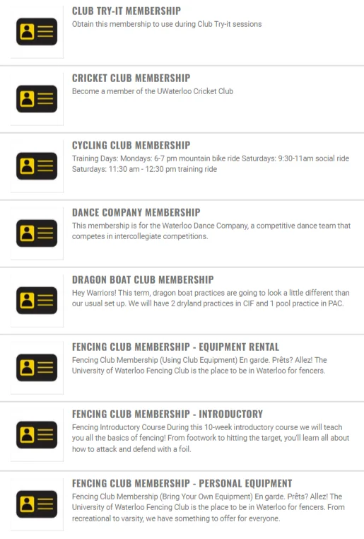

# How to Join
Visit the [club membership page](https://warrior.uwaterloo.ca/membership/) on the Warrior Athletics Website. You must be a current student or alumni/employee with a gym membership in order to view this page. 

## Memberships Available
We currently offer:
- [Club Equipment Rental](https://warrior.uwaterloo.ca/membership/GetMembershipSummary?membershipProductId=33d9b5a2-b8a3-440a-8ee0-134a42f72262)
- [Introductory/Beginner](https://warrior.uwaterloo.ca/membership/GetMembershipSummary?membershipProductId=de7ba179-62b6-4c7a-aa58-4021819c964b)
- [Personal Equipment](https://warrior.uwaterloo.ca/membership/GetMembershipSummary?membershipProductId=13e65642-d900-496a-b2be-65b601fb4a20)

For more information, look at [Programs and Fees](/programs-and-fees)